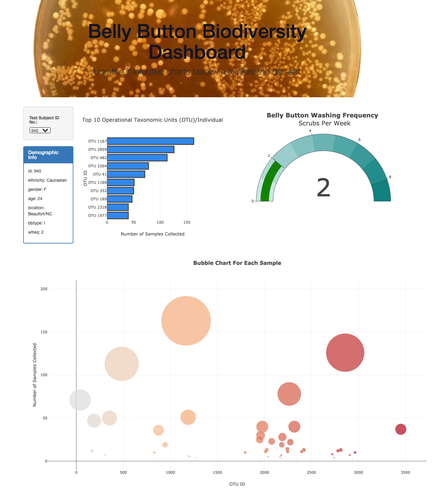
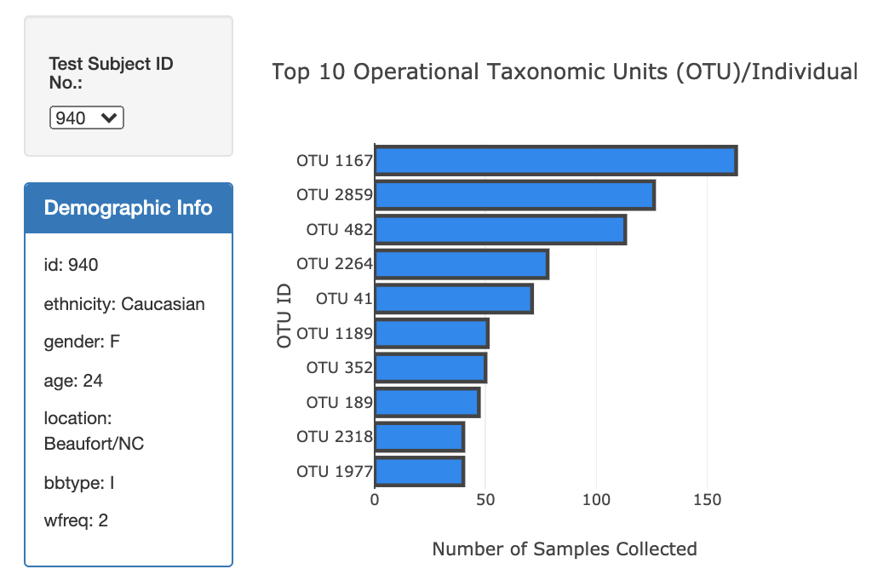
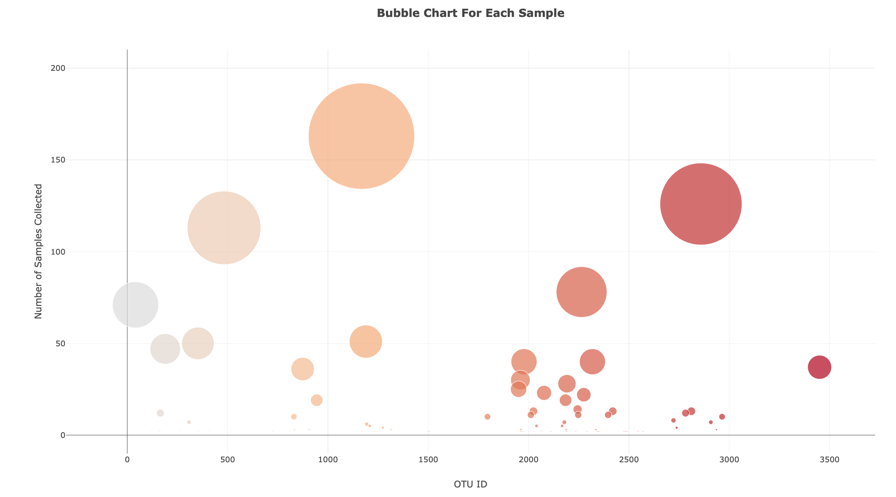
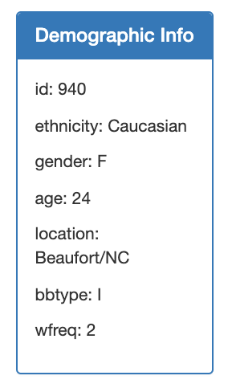

# Plot.ly-challenge - Belly Button Biodiversity

In this assignment, an interactive dashboard was built to explore the Belly Button Biodiversity dataset, which catalogs the microbes that colonize human navels.
The dataset reveals that a small handful of microbial species (also called operational taxonomic units, or OTUs, in the study) were present in more than 70% of people, while the rest were relatively rare.

## Step 1: Plotly

1. The D3 library was used to read in samples.json.

2. A horizontal bar chart was created with a dropdown menu to display the top 10 OTUs found in that individual.

- sample_values were used as the values for the bar chart.
- otu_ids were used as the labels for the bar chart.
- otu_labels were used as the hovertext for the chart.

3. A bubble chart that displays each sample was created.

- otu_ids were used for the x values.
- sample_values were used for the y values.
- sample_values were used for the marker size.
- otu_ids were used for the marker colors.
- otu_labels were used for the text values.

4. The sample metadata was displayed, i.e., an individual's demographic information.

5. Each key-value pair from the metadata JSON object was displayed on the page.

6. All of the plots are updated any time that a new sample is selected.

